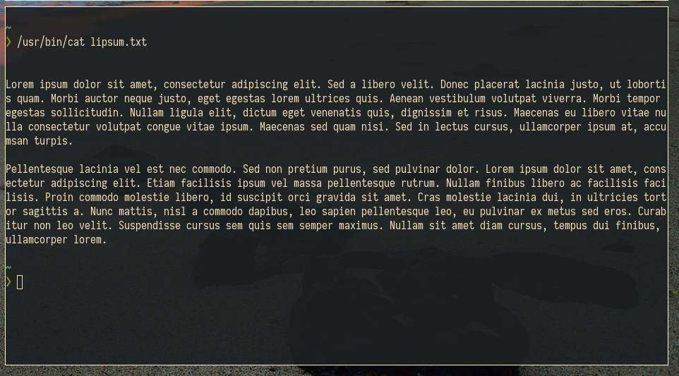
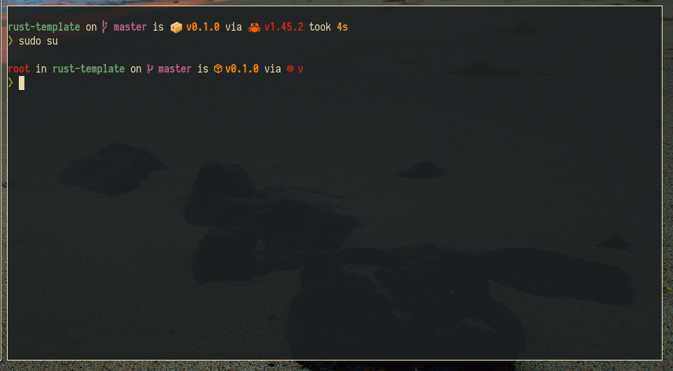
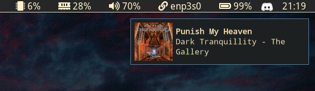
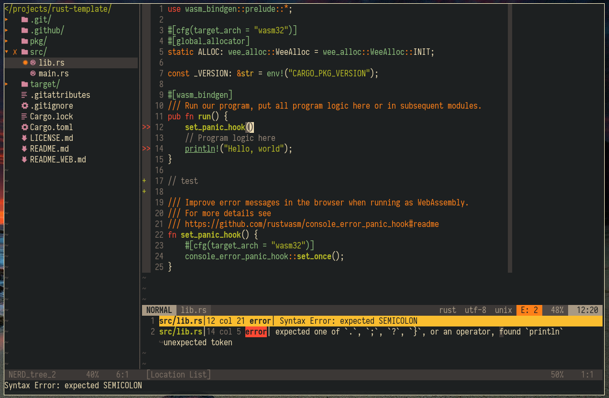
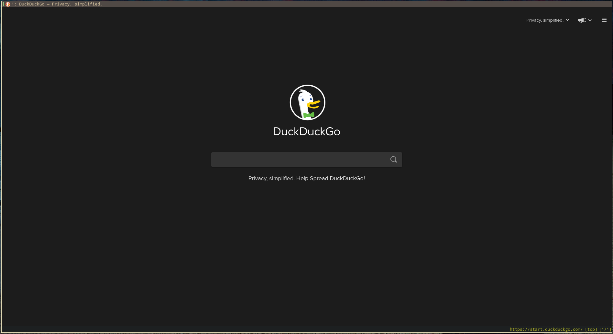
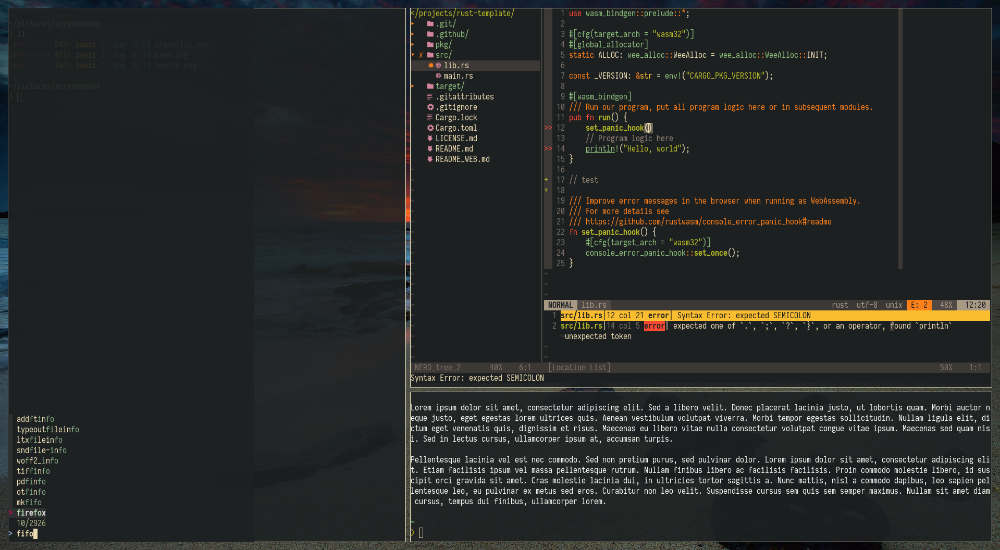
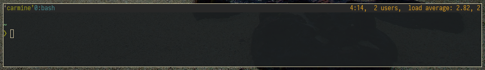

# Dotfiles

Zaszi's collection of personal dotfiles.

## Usage

This repository contains my dotfiles. Included in the documentation below is a list of dependencies per configuration. These are not dependencies of the software in question but rather the binaries and libraries that my particular configuration expects. The color scheme used in most configurations is [Gruvbox (Dark mode - Hard contrast)](https://github.com/morhetz/gruvbox) and the font is [Iosevka Nerd Font](https://www.nerdfonts.com/).

I deploy these files to my machines using [Ansible](https://www.ansible.com/) (my Ansible dotfiles role can be found [here](https://github.com/zaszi/ansible-role-dotfiles)). Only the latest stable upstream releases of all respective software is supported.

## Features

- [Alacritty](#Alacritty)
- [Bash](#Bash)
- [Mako](#Mako)
- [Neovim](#Neovim)
- [Qutebrowser](#Qutebrowser)
- [Sway](#Sway)
- [Tmux](#Tmux)
- [Waybar](#Waybar)

### Alacritty

- **Homepage:** https://github.com/alacritty/alacritty
- **Description:** A cross-platform, GPU-accelerated terminal emulator.
- **Config location:** `~/.config/alacritty`
- **Dependencies:** [Iosevka Nerd Font](https://www.nerdfonts.com/)

Alacritty is fast, lightweight and comes with Wayland support out-of-the-box. My particular setup comes with slight transparency, the `gruvbox` color scheme and the `Iosevka Nerd Font`.

### Bash

- **Homepage:** https://www.gnu.org/software/bash/
- **Description:** The classic, tried-and-true Bourne Again Shell.
- **Config location:** `~/.bashrc` and `~/.bash_profile`
- **Dependencies:** All dependencies are optional: [bash-completion](https://github.com/scop/bash-completion), [bat](https://github.com/sharkdp/bat), [curl](https://curl.haxx.se/), [exa](https://github.com/ogham/exa), [firefox](https://www.mozilla.org/en-US/firefox/new/), [fzf](https://github.com/junegunn/fzf), [git](https://git-scm.com/), [gnupg](https://gnupg.org/), [neovim](https://neovim.io/), [openssh](https://www.openssh.com/), [pkgfile](https://github.com/falconindy/pkgfile), [rustup](https://rustup.rs/), [starship](https://starship.rs/), [yay](https://github.com/Jguer/yay)

Bash is the default shell for the majority of distributions and environments. As such, there is significant value in sticking to POSIX as much as possible so my workflow is applicable to most environments where daily work takes me. In a similar vein, you won't find many aliases in here, either. Most reasons for using `zsh` or `fish` (such as a nice prompt) disappear with the use of `starship`. I do use some modern replacements of existing tooling here, but they are set up in such a way they do not depend on learning new shortcuts or flags. Dependencies on commands are checked so nothing should fail if certain binaries are missing.

### Mako

- **Homepage:** https://github.com/emersion/mako
- **Description:** A lightweight notification daemon for Wayland.
- **Config location:** `~/.config/mako/config`
- **Dependencies:** None

Mako is a lightweight notification daemon that works on Sway. It has been
styled to fit in with the rest of my setup and I've added a timeout so
notifications don't have to be clicked away.

### Neovim

- **Homepage:** https://neovim.io/
- **Description:** A hyperextensible Vim-based text editor.
- **Config location:** `~/.config/nvim/init.vim`
- **Dependencies:** [prettier](https://github.com/prettier/prettier), [proselint](https://github.com/amperser/proselint), [rust-analyzer](https://github.com/rust-analyzer/rust-analyzer), [shfmt](https://github.com/mvdan/sh), [wl-clipboard](https://github.com/bugaevc/wl-clipboard), in addition to the plugins listed below.

Since I spend a lot of my days on environments with no graphical interface, (Neo)vim is my bread and butter. As I kept struggling with trying to make various IDEs more Vim-like, I ended up going the other way around and making Neovim more like an IDE. This lets me keep all the benefits and workflows of a vim-like editor, yet also have the few IDE-specific tools (such as a project drawer and linting) when I need them. Despite the size of this configuration, I try to keep custom keybindings and plugins to a minimum and mostly try to improve what is already there.

I use the following plugins. These are also installed with Ansible directly into `~/.config/nvim/pack/plugin/start`, using Neovim's native package loader.

- [ale](https://github.com/w0rp/ale.git): Asynchronous Lint Engine.
- [auto-pairs](https://github.com/jiangmiao/auto-pairs.git): Insert or delete brackets, parens, quotes in pair.
- [fzf.vim](https://github.com/junegunn/fzf.vim.git): Wrapper for fzf, the command-line fuzzy finder.
- [gruvbox](https://github.com/morhetz/gruvbox.git): The Gruvbox color scheme.
- [lightline.vim](https://github.com/itchyny/lightline.vim.git): A light and configurable statusline/tabline plugin.
- [lightline-ale](https://github.com/maximbaz/lightline-ale.git): An ALE indicator for lightline.
- [nerdtree](https://github.com/scrooloose/nerdtree.git): A file system explorer and project drawer.
- [nerdtree-git-plugin](https://github.com/Xuyuanp/nerdtree-git-plugin.git): A Nerdtree plugin showing git status flags.
- [ron-rs](https://github.com/ron-rs/ron.vim.git): Syntax highlighting for RON (Rusty Object Notation) files.
- [supertab](https://github.com/ervandew/supertab.git): Use tabs for insert completions.
- [vim-devicons](https://github.com/ryanoasis/vim-devicons.git): Icons for Nerdtree.
- [vim-gitgutter](https://github.com/airblade/vim-gitgutter.git): Git diffs in the sign column.
- [vimwiki](https://github.com/vimwiki/vimwiki.git): A personal wiki for Vim.

### Qutebrowser

- **Homepage:** https://qutebrowser.org/
- **Description:** Qutebrowser is a keyboard-focused browser with a minimal GUI.
- **Config location:** `~/.config/qutebrowser/config.py`
- **Dependencies:** [pdfjs](https://mozilla.github.io/pdf.js/)

While I've used Firefox for years, there's no denying that there's been questionable decisions on Mozilla's part and the browser itself is not without its fair share of controversy today. Furthermore, Mozilla's lay-offs of 25% of its workforce [[1]](https://arstechnica.com/information-technology/2020/08/firefox-maker-mozilla-lays-off-250-workers-says-covid-19-lowered-revenue/), raising executive pay 400% as their market share declined 85% [[2]](http://calpaterson.com/mozilla.html) and doubling down on a losing strategy [[3]](https://killedbymozilla.com/)[[4]](https://blog.mozilla.org/blog/2020/08/11/changing-world-changing-mozilla/) were enough to make me consider an alternative before that ship sinks completely.

Qutebrowser is open-source, lightweight, hackable browser that has vim-like keybindings. It's pretty great. This configuration enforces Qutebrowser's Qt backend to use the Wayland platform. As per usual, there's also the Gruvbox color scheme, Neovim integration, some saner defaults and dark mode.

### Sway

- **Homepage:** https://swaywm.org/
- **Description:** An i3-compatible Wayland compositor.
- **Config location:** `~/.config/sway/config`
- **Dependencies:** [alacritty](https://github.com/alacritty/alacritty), [firefox](https://www.mozilla.org/en-US/firefox/new/), [fzf](https://github.com/junegunn/fzf), [grim](https://github.com/emersion/grim), [light](https://github.com/haikarainen/light), [playerctl](https://github.com/altdesktop/playerctl), [pulseaudio-ctl](https://github.com/graysky2/pulseaudio-ctl), [slurp](https://github.com/emersion/slurp), [waybar](https://github.com/Alexays/Waybar), [swaybg](https://github.com/swaywm/swaybg), [swayidle](https://github.com/swaywm/swayidle), [swaylock](https://github.com/swaywm/swaylock)

I prefer using a tiling window manager. Sway being essentially i3 for Wayland, it's been my daily driver ever since I made the switch to a Wayland setup. The configuration file holds a significant amount of shortcuts and utilizes several external tools, so keep in mind my configuration will most likely not work as a drop-in replacement for you unless you install all of the above dependencies. Note that for the backlight to work without privilege escalation, you will also need to install these [udev rules](https://github.com/haikarainen/light/blob/master/90-backlight.rules) and add your user to the `video` group.

### Tmux

- **Homepage:** https://github.com/tmux/tmux
- **Description:** A terminal multiplexer.
- **Config location:** `~/.tmux.conf`
- **Dependencies:** None

While I dislike overengineered tmux setups, having a terminal multiplexer at my disposal for detaching sessions and window management in SSH sessions is invaluable. I use a minimal configuration, so there's not much going on here beyond some quality-of-life keybindings and saner defaults.

### Waybar

- **Homepage:** https://github.com/Alexays/Waybar
- **Description:** A Highly customizable Wayland bar for Sway and Wlroots based compositors.
- **Config location:** `~/.config/waybar/config` and `~/.config/waybar/style.css`
- **Dependencies:** [font awesome](https://fontawesome.com/), [playerctl](https://github.com/altdesktop/playerctl), [pulseaudio](https://www.freedesktop.org/wiki/Software/PulseAudio/), [sway](https://swaywm.org/)

This is a lightweight yet highly customizable status bar that works perfectly with Sway. My configuration comes with the usual suspects that you'd want in a status bar. From left-to-right: workspaces, current music track, window name, RAM usage, CPU usage, volume, network, battery and clock. I could not get proper-sized icons to work with the `Iosevka Nerd Font`, so I use `Font Awesome` for waybar.

## Contribution

Found a problem or have a suggestion? Feel free to open an issue.

## License

Dotfiles is licensed under the [MIT license](https://github.com/zaszi/dotfiles/blob/master/LICENSE.md).
